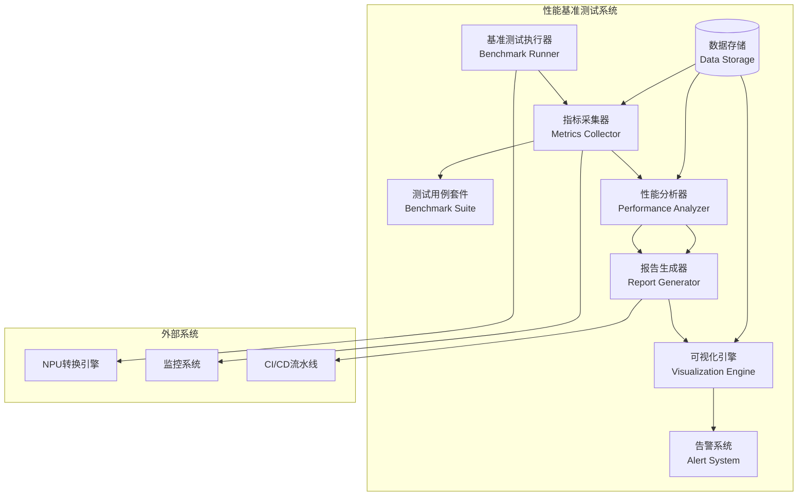
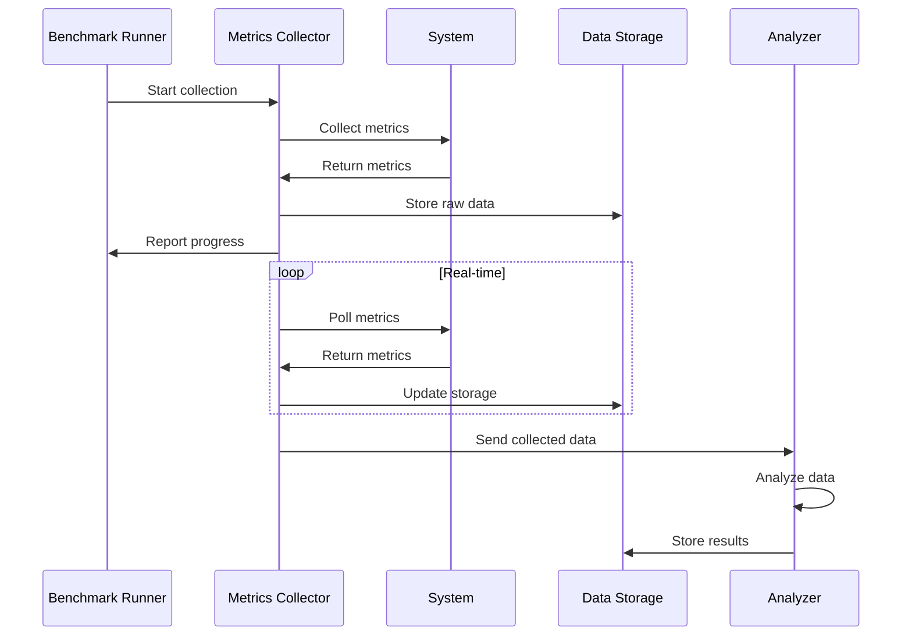
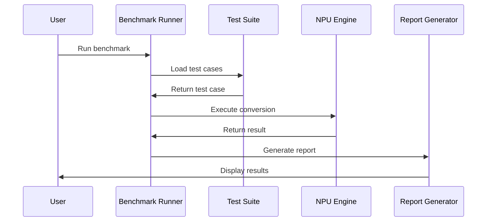

# Story 3.5 - 性能基准测试系统架构设计

**项目**: XLeRobot NPU模型转换工具
**Epic**: Epic 3 - 性能优化与扩展
**故事编号**: Story 3.5
**版本**: v1.0
**创建日期**: 2025-10-29
**状态**: Phase 1 - 架构设计

---

## 📋 文档概述

本文档描述了性能基准测试系统的架构设计，包括系统架构、核心组件、数据流、技术选型等。

---

## 🏗️ 系统架构

### 总体架构图



### 架构层次

#### 1. 数据采集层 (Data Collection Layer)
- **指标采集器** (Metrics Collector)
- 负责采集系统性能指标
- 支持多种数据源和格式

#### 2. 测试执行层 (Test Execution Layer)
- **基准测试执行器** (Benchmark Runner)
- 负责执行性能测试用例
- 支持并发和分布式测试

#### 3. 数据存储层 (Data Storage Layer)
- **时序数据库** (Time-Series Database)
- 存储性能指标历史数据
- 支持快速查询和聚合

#### 4. 分析处理层 (Analysis Layer)
- **性能分析器** (Performance Analyzer)
- 分析性能数据和趋势
- 生成性能报告和建议

#### 5. 展示层 (Presentation Layer)
- **可视化引擎** (Visualization Engine)
- 提供图表和仪表盘
- 支持交互式分析

#### 6. 告警层 (Alert Layer)
- **告警系统** (Alert System)
- 监控性能异常
- 发送通知和告警

---

## 🧩 核心组件设计

### 1. 基准测试执行器 (Benchmark Runner)

**职责**:
- 管理性能测试的生命周期
- 协调测试用例的执行
- 处理并发和分布式测试
- 记录测试执行日志

**接口设计**:
```python
class BenchmarkRunner:
    def __init__(self, config: BenchmarkConfig):
        """初始化基准测试执行器"""
        self.config = config
        self.test_suite = BenchmarkSuite()
        self.metrics_collector = MetricsCollector()

    def run_benchmark(self, test_case: TestCase) -> BenchmarkResult:
        """执行单个基准测试"""
        pass

    def run_suite(self, test_suite: TestSuite) -> BenchmarkSuiteResult:
        """执行测试套件"""
        pass

    def run_concurrent(self, test_cases: List[TestCase]) -> ConcurrentBenchmarkResult:
        """并发执行多个测试"""
        pass
```

**核心功能**:
- 测试用例管理
- 执行计划调度
- 并发控制
- 错误处理和恢复
- 资源管理

### 2. 指标采集器 (Metrics Collector)

**职责**:
- 采集系统性能指标
- 支持多种数据源
- 实时和批量采集
- 数据清洗和格式化

**指标类型**:
```python
class MetricsType:
    # CPU指标
    CPU_UTILIZATION = "cpu_utilization"
    CPU_LOAD_AVERAGE = "cpu_load_average"

    # 内存指标
    MEMORY_USAGE = "memory_usage"
    MEMORY_AVAILABLE = "memory_available"

    # GPU/NPU指标
    GPU_UTILIZATION = "gpu_utilization"
    GPU_MEMORY = "gpu_memory"
    NPU_UTILIZATION = "npu_utilization"
    NPU_MEMORY = "npu_memory"

    # 转换性能指标
    CONVERSION_THROUGHPUT = "conversion_throughput"
    CONVERSION_LATENCY = "conversion_latency"
    CONVERSION_SUCCESS_RATE = "conversion_success_rate"

    # I/O指标
    DISK_IO = "disk_io"
    NETWORK_IO = "network_io"
```

**接口设计**:
```python
class MetricsCollector:
    def __init__(self, config: MetricsConfig):
        self.config = config
        self.metrics_buffer = MetricsBuffer()

    def collect_system_metrics(self) -> SystemMetrics:
        """采集系统指标"""
        pass

    def collect_conversion_metrics(self, model_type: str) -> ConversionMetrics:
        """采集转换性能指标"""
        pass

    def collect_gpu_metrics(self) -> GPUMetrics:
        """采集GPU/NPU指标"""
        pass

    def start_real_time_collection(self, interval: int):
        """开始实时采集"""
        pass

    def stop_real_time_collection(self):
        """停止实时采集"""
        pass
```

### 3. 测试用例套件 (Benchmark Suite)

**职责**:
- 定义标准测试用例
- 管理测试用例的生命周期
- 支持测试用例参数化
- 提供测试用例执行接口

**测试场景**:
```python
class BenchmarkTestCases:
    # 单模型转换测试
    SINGLE_MODEL_ASR = "sensevoice_asr_conversion"
    SINGLE_MODEL_TTS_VITS = "vits_cantonese_tts_conversion"
    SINGLE_MODEL_TTS_PIPER = "piper_vits_tts_conversion"

    # 多模型并发测试
    CONCURRENT_MODELS = "concurrent_models_conversion"
    CONCURRENT_ASR_TTS = "concurrent_asr_tts_conversion"

    # 性能压力测试
    STRESS_TEST_HIGH_THROUGHPUT = "stress_test_high_throughput"
    STRESS_TEST_HIGH_CONCURRENCY = "stress_test_high_concurrency"

    # 长期稳定性测试
    LONG_TERM_STABILITY = "long_term_stability_test"
    MEMORY_LEAK_TEST = "memory_leak_test"
```

**接口设计**:
```python
class BenchmarkSuite:
    def __init__(self, config: SuiteConfig):
        self.config = config
        self.test_cases = self._load_test_cases()

    def get_test_case(self, test_id: str) -> TestCase:
        """获取指定测试用例"""
        pass

    def list_test_cases(self, category: str = None) -> List[TestCase]:
        """列出测试用例"""
        pass

    def validate_test_case(self, test_case: TestCase) -> ValidationResult:
        """验证测试用例"""
        pass

    def _load_test_cases(self):
        """加载测试用例"""
        pass
```

### 4. 性能分析器 (Performance Analyzer)

**职责**:
- 分析性能数据
- 计算性能指标
- 生成性能报告
- 提供性能优化建议

**分析功能**:
```python
class PerformanceAnalyzer:
    def __init__(self, config: AnalyzerConfig):
        self.config = config

    def calculate_statistics(self, metrics: List[Metric]) -> Statistics:
        """计算统计指标"""
        pass

    def detect_anomalies(self, metrics: List[Metric]) -> List[Anomaly]:
        """检测性能异常"""
        pass

    def compare_benchmarks(self, baseline: BenchmarkResult, current: BenchmarkResult) -> ComparisonResult:
        """对比基准测试结果"""
        pass

    def generate_recommendations(self, analysis_result: AnalysisResult) -> List[Recommendation]:
        """生成优化建议"""
        pass

    def trend_analysis(self, historical_data: List[BenchmarkResult]) -> TrendAnalysis:
        """趋势分析"""
        pass
```

### 5. 报告生成器 (Report Generator)

**职责**:
- 生成性能测试报告
- 支持多种输出格式
- 提供报告模板
- 自动化报告生成

**报告类型**:
```python
class ReportTypes:
    HTML_REPORT = "html"
    PDF_REPORT = "pdf"
    JSON_REPORT = "json"
    CSV_REPORT = "csv"
    PROMETHEUS_FORMAT = "prometheus"
```

**接口设计**:
```python
class ReportGenerator:
    def __init__(self, config: ReportConfig):
        self.config = config

    def generate_summary_report(self, result: BenchmarkSuiteResult) -> SummaryReport:
        """生成汇总报告"""
        pass

    def generate_detailed_report(self, result: BenchmarkSuiteResult) -> DetailedReport:
        """生成详细报告"""
        pass

    def export_report(self, report: Report, format: str, output_path: str):
        """导出报告"""
        pass

    def create_dashboard(self, data: BenchmarkData) -> Dashboard:
        """创建仪表盘"""
        pass
```

### 6. 可视化引擎 (Visualization Engine)

**职责**:
- 生成性能图表
- 提供交互式可视化
- 支持多种图表类型
- 自定义图表样式

**图表类型**:
```python
class ChartTypes:
    LINE_CHART = "line"
    BAR_CHART = "bar"
    HISTOGRAM = "histogram"
    HEATMAP = "heatmap"
    SCATTER_PLOT = "scatter"
    GAUGE_CHART = "gauge"
    TIME_SERIES = "time_series"
```

**接口设计**:
```python
class VisualizationEngine:
    def __init__(self, config: VisualizationConfig):
        self.config = config

    def create_time_series_chart(self, data: TimeSeriesData) -> Chart:
        """创建时间序列图表"""
        pass

    def create_comparison_chart(self, data: ComparisonData) -> Chart:
        """创建对比图表"""
        pass

    def create_distribution_chart(self, data: DistributionData) -> Chart:
        """创建分布图表"""
        pass

    def create_dashboard(self, charts: List[Chart]) -> Dashboard:
        """创建仪表盘"""
        pass

    def export_chart(self, chart: Chart, format: str, output_path: str):
        """导出图表"""
        pass
```

### 7. 告警系统 (Alert System)

**职责**:
- 监控性能指标
- 检测性能异常
- 发送告警通知
- 支持多种告警渠道

**告警类型**:
```python
class AlertTypes:
    THRESHOLD_ALERT = "threshold"
    TREND_ALERT = "trend"
    ANOMALY_ALERT = "anomaly"
    DEGRADATION_ALERT = "degradation"
```

**接口设计**:
```python
class AlertSystem:
    def __init__(self, config: AlertConfig):
        self.config = config
        self.alert_rules = self._load_alert_rules()

    def check_alerts(self, metrics: SystemMetrics) -> List[Alert]:
        """检查告警条件"""
        pass

    def send_alert(self, alert: Alert):
        """发送告警"""
        pass

    def add_alert_rule(self, rule: AlertRule):
        """添加告警规则"""
        pass

    def _load_alert_rules(self):
        """加载告警规则"""
        pass
```

---

## 📊 性能指标定义

### 核心指标

#### 1. 转换吞吐量 (Conversion Throughput)
```yaml
metric_name: conversion_throughput
unit: models/minute
description: 每分钟成功转换的模型数量
measurement:
  - type: counter
    scope: global
  - type: rate
    window: 1m
thresholds:
  warning: 8.0
  critical: 5.0
```

#### 2. 转换延迟 (Conversion Latency)
```yaml
metric_name: conversion_latency
unit: seconds
description: 模型转换的响应时间
measurement:
  - type: histogram
    buckets: [1, 5, 10, 30, 60, 120, 300]
    percentiles: [50, 90, 95, 99]
thresholds:
  p50_warning: 10
  p50_critical: 20
  p95_warning: 30
  p95_critical: 60
```

#### 3. CPU使用率 (CPU Utilization)
```yaml
metric_name: cpu_utilization
unit: percentage
description: CPU使用率百分比
measurement:
  - type: gauge
    interval: 1s
  - type: average
    window: 1m
thresholds:
  warning: 70
  critical: 85
```

#### 4. 内存使用率 (Memory Utilization)
```yaml
metric_name: memory_utilization
unit: MB
description: 内存使用量
measurement:
  - type: gauge
    interval: 1s
  - type: peak
    window: 1m
thresholds:
  warning: 3000
  critical: 4000
```

#### 5. GPU/NPU利用率 (GPU/NPU Utilization)
```yaml
metric_name: gpu_utilization
unit: percentage
description: GPU使用率百分比
measurement:
  - type: gauge
    interval: 1s
  - type: average
    window: 1m
thresholds:
  warning: 60
  critical: 80

metric_name: npu_utilization
unit: percentage
description: NPU使用率百分比
measurement:
  - type: gauge
    interval: 1s
  - type: average
    window: 1m
thresholds:
  warning: 60
  critical: 80
```

### 计算公式

#### 吞吐量计算
```
throughput = successful_conversions / time_period
```

#### 延迟计算
```
p50_latency = percentile(data, 0.5)
p95_latency = percentile(data, 0.95)
p99_latency = percentile(data, 0.99)
```

#### 资源利用率计算
```
cpu_utilization = (cpu_time / wall_time) * 100
memory_utilization = (used_memory / total_memory) * 100
gpu_utilization = (gpu_time / wall_time) * 100
```

---

## 🧪 测试用例设计

### 测试场景分类

#### 1. 基础功能测试
- **单模型转换性能测试**
  - SenseVoice ASR模型转换
  - VITS-Cantonese TTS模型转换
  - Piper VITS TTS模型转换

#### 2. 并发性能测试
- **多模型并发转换**
  - 2个模型并发
  - 5个模型并发
  - 10个模型并发
  - 20个模型并发

#### 3. 压力测试
- **高吞吐量测试**
  - 目标: 15 模型/分钟
  - 压力测试: 20 模型/分钟
  - 极限测试: 30 模型/分钟

#### 4. 稳定性测试
- **长期运行测试**
  - 持续时间: 24小时
  - 监控指标: 内存泄漏、性能衰减

### 测试用例详细设计

#### TC-001: SenseVoice ASR单模型转换性能测试

```yaml
test_case_id: TC-001
name: SenseVoice ASR模型转换性能测试
description: 测试SenseVoice ASR模型的转换性能
category: single_model
model_type: asr
model_name: SenseVoice

parameters:
  model_path: "/models/sensevoice"
  input_format: "onnx"
  output_format: "npu"
  batch_size: [1, 4, 8, 16]
  precision: ["fp32", "fp16", "int8"]
  concurrency: 1

expected_results:
  throughput:
    fp32: "> 12 models/minute"
    fp16: "> 15 models/minute"
    int8: "> 18 models/minute"
  latency_p95:
    fp32: "< 60 seconds"
    fp16: "< 45 seconds"
    int8: "< 30 seconds"
  resource_usage:
    cpu: "< 70%"
    memory: "< 3GB"
    gpu: "< 80%"
    npu: "< 80%"
```

#### TC-002: VITS-Cantonese TTS单模型转换性能测试

```yaml
test_case_id: TC-002
name: VITS-Cantonese TTS模型转换性能测试
description: 测试VITS-Cantonese TTS模型的转换性能
category: single_model
model_type: tts
model_name: VITS-Cantonese

parameters:
  model_path: "/models/vits-cantonese"
  input_format: "pytorch"
  output_format: "npu"
  batch_size: [1, 2, 4, 8]
  precision: ["fp32", "fp16"]
  concurrency: 1

expected_results:
  throughput:
    fp32: "> 10 models/minute"
    fp16: "> 14 models/minute"
  latency_p95:
    fp32: "< 80 seconds"
    fp16: "< 60 seconds"
  resource_usage:
    cpu: "< 70%"
    memory: "< 3.5GB"
    gpu: "< 80%"
    npu: "< 80%"
```

#### TC-003: 多模型并发转换性能测试

```yaml
test_case_id: TC-003
name: 多模型并发转换性能测试
description: 测试多模型并发转换的系统性能
category: concurrent
model_type: mixed
model_names:
  - "SenseVoice"
  - "VITS-Cantonese"
  - "Piper-VITS"

parameters:
  concurrent_models: [2, 5, 10]
  model_mix_ratio:
    asr: 0.4
    tts: 0.6
  batch_size: 4
  precision: fp16

expected_results:
  throughput_per_model: "> 8 models/minute"
  total_throughput: "> 40 models/minute"
  latency_p95: "< 90 seconds"
  resource_usage:
    cpu: "< 85%"
    memory: "< 4GB"
    gpu: "< 90%"
    npu: "< 90%"
```

#### TC-004: 压力测试

```yaml
test_case_id: TC-004
name: 高压力转换性能测试
description: 测试系统在高压下的性能表现
category: stress_test
duration: "2 hours"

parameters:
  target_throughput: 20
  ramp_up_time: "10 minutes"
  steady_state_time: "1 hour"
  ramp_down_time: "10 minutes"
  batch_size: 8
  precision: fp16

expected_results:
  no_errors: true
  no_performance_degradation: true
  resource_usage_stable: true
  throughput_maintained: "> 90% of target"
```

#### TC-005: 长期稳定性测试

```yaml
test_case_id: TC-005
name: 24小时长期稳定性测试
description: 测试系统长期运行的稳定性
category: stability_test
duration: "24 hours"

parameters:
  average_throughput: 10
  batch_size: 4
  precision: fp16
  monitoring_interval: "5 minutes"

expected_results:
  no_memory_leaks: true
  no_performance_degradation: true
  error_rate: "< 0.1%"
  resource_usage_stable: true
```

---

## 💻 技术选型

### 1. 编程语言和框架

#### Python
- **版本**: Python 3.9+
- **用途**: 主要开发语言
- **选择理由**:
  - 丰富的生态库
  - 易于开发和维护
  - 强大的数据处理能力

#### 第三方库
```python
# 数据采集
psutil >= 5.9.0          # 系统资源监控
GPUtil >= 1.4.0          # GPU监控
pynvml >= 11.5.0         # NVIDIA GPU监控
nvidia-ml-py >= 12.535   # NVIDIA GPU高级监控

# 数据存储
sqlite3                  # 轻量级数据库 (内置)
influxdb-client >= 1.28  # 时序数据库
pandas >= 1.5.0          # 数据处理

# 可视化
matplotlib >= 3.6.0      # 基础绘图
plotly >= 5.11.0         # 交互式图表
dash >= 2.6.0            # Web应用
seaborn >= 0.12.0        # 统计图表

# 报告生成
jinja2 >= 3.1.0          # 模板引擎
weasyprint >= 56.0       # PDF生成
markdown >= 3.4.0        # Markdown处理

# 测试框架
pytest >= 7.2.0          # 测试框架
pytest-benchmark >= 3.4  # 性能基准测试
pytest-cov >= 4.0.0      # 代码覆盖率

# 配置管理
pyyaml >= 6.0            # YAML配置文件
pydantic >= 1.10.0       # 数据验证

# 日志和监控
loguru >= 0.6.0          # 日志记录
prometheus-client >= 0.15 # Prometheus监控

# 并发和多线程
asyncio                   # 异步IO (内置)
concurrent.futures        # 并发执行 (内置)
threading                 # 多线程 (内置)

# HTTP和API
fastapi >= 0.85.0        # Web API框架
uvicorn >= 0.18.0        # ASGI服务器
requests >= 2.28.0       # HTTP客户端
```

### 2. 数据库选型

#### 主存储: SQLite
- **用途**: 轻量级本地存储
- **场景**: 开发测试、单机部署
- **优势**:
  - 无需安装，部署简单
  - 性能满足中小规模需求
  - 支持ACID事务
  - 跨平台兼容

#### 可选存储: InfluxDB
- **用途**: 生产环境时序数据库
- **场景**: 大规模部署、长期历史数据
- **优势**:
  - 专为时序数据优化
  - 高压缩比存储
  - 高性能查询
  - 集群支持

### 3. 可视化方案

#### 方案1: matplotlib + seaborn
- **用途**: 生成静态图表和报告
- **场景**: 自动化报告、文档嵌入
- **优势**:
  - 功能强大
  - 自定义能力强
  - 社区支持好

#### 方案2: Plotly + Dash
- **用途**: 交互式仪表盘
- **场景**: 实时监控、交互分析
- **优势**:
  - 交互性强
  - 部署简单
  - 现代化界面

#### 方案3: Grafana
- **用途**: 专业监控仪表盘
- **场景**: 生产环境监控
- **优势**:
  - 丰富的监控能力
  - 多数据源支持
  - 告警功能完善

### 4. CI/CD集成

#### GitHub Actions
- **用途**: 自动化测试和部署
- **流程**:
  1. 提交代码触发测试
  2. 运行性能基准测试
  3. 生成测试报告
  4. 性能回归检测
  5. 自动发布

#### 配置文件
```yaml
# .github/workflows/performance-benchmark.yml
name: Performance Benchmark

on:
  push:
    branches: [main, develop]
  pull_request:
    branches: [main]
  schedule:
    - cron: '0 2 * * *'  # 每天凌晨2点运行

jobs:
  benchmark:
    runs-on: ubuntu-latest
    steps:
      - uses: actions/checkout@v3
      - name: Setup Python
        uses: actions/setup-python@v4
        with:
          python-version: '3.9'
      - name: Install dependencies
        run: |
          pip install -r requirements.txt
          pip install -r requirements-test.txt
      - name: Run Performance Benchmark
        run: |
          python -m pytest tests/performance/ -v
          python scripts/run_benchmark.py
      - name: Upload Results
        uses: actions/upload-artifact@v3
        with:
          name: benchmark-results
          path: reports/performance/
```

### 5. 部署方案

#### Docker容器化
```dockerfile
# Dockerfile
FROM python:3.9-slim

WORKDIR /app

COPY requirements.txt .
RUN pip install -r requirements.txt

COPY src/ ./src/
COPY config/ ./config/

CMD ["python", "-m", "npu_converter.performance.benchmark_runner"]
```

#### Kubernetes部署
```yaml
# k8s-deployment.yaml
apiVersion: apps/v1
kind: Deployment
metadata:
  name: performance-benchmark
spec:
  replicas: 1
  selector:
    matchLabels:
      app: performance-benchmark
  template:
    metadata:
      labels:
        app: performance-benchmark
    spec:
      containers:
      - name: benchmark
        image: xlerobot/performance-benchmark:latest
        resources:
          requests:
            memory: "2Gi"
            cpu: "1000m"
          limits:
            memory: "4Gi"
            cpu: "2000m"
```

---

## 📈 数据流设计

### 数据采集流程



### 测试执行流程



### 数据存储结构

```
performance_benchmark_db/
├── raw_metrics/          # 原始指标数据
│   ├── system_metrics/   # 系统指标
│   ├── conversion_metrics/ # 转换指标
│   └── gpu_metrics/      # GPU/NPU指标
├── benchmark_results/    # 基准测试结果
│   ├── test_case_id/     # 测试用例ID
│   │   ├── timestamp_1/  # 时间戳
│   │   └── timestamp_2/
│   └── summary/          # 汇总数据
├── analysis_results/     # 分析结果
│   ├── statistics/       # 统计分析
│   ├── anomalies/        # 异常检测
│   └── trends/           # 趋势分析
└── reports/              # 生成报告
    ├── html/             # HTML报告
    ├── pdf/              # PDF报告
    └── json/             # JSON数据
```

---

## 🔒 安全和权限

### 数据安全
- 敏感指标数据加密存储
- 访问日志记录
- 数据备份策略

### 权限控制
- 基于角色的访问控制 (RBAC)
- API访问权限管理
- 操作审计日志

### 合规要求
- 数据隐私保护
- 审计追踪
- 定期安全评估

---

## 📋 实施计划

### Phase 1: 架构设计 ✅
- [x] 系统架构设计文档
- [x] 性能指标定义
- [x] 测试用例设计
- [x] 技术选型确认
- [x] 数据流设计

### Phase 2: 核心功能实现
- [ ] 实现基准测试执行器
- [ ] 实现指标采集器
- [ ] 实现测试用例套件
- [ ] 实现性能分析器
- [ ] 实现报告生成器

### Phase 3: 可视化和告警
- [ ] 实现可视化引擎
- [ ] 实现告警系统
- [ ] 创建仪表盘
- [ ] 配置告警规则

### Phase 4: 集成和测试
- [ ] CI/CD集成
- [ ] 单元测试 (覆盖率>90%)
- [ ] 集成测试
- [ ] 性能测试
- [ ] 端到端测试

### Phase 5: 文档和交付
- [ ] API文档
- [ ] 用户指南
- [ ] 部署文档
- [ ] 性能测试报告

---

## 🎯 验收标准

### 技术验收标准
1. **性能指标监控**: 100%覆盖核心指标
2. **测试用例执行**: 所有测试用例100%通过
3. **数据准确性**: 指标数据误差<1%
4. **系统稳定性**: 99.9%可用性
5. **报告生成**: 支持所有指定的输出格式

### 质量验收标准
1. **代码质量**: 代码覆盖率>90%
2. **文档完整性**: 文档覆盖率100%
3. **测试覆盖率**: 单元测试覆盖率>90%
4. **性能达标**: 所有性能指标达标

---

## 📚 参考文档

### 内部文档
- [XLeRobot NPU转换工具技术文档](../technical/)
- [性能优化指南](../technical/performance-optimization.md)
- [项目架构文档](../architecture/)

### 外部文档
- [pytest-benchmark文档](https://pytest-benchmark.readthedocs.io/)
- [psutil文档](https://psutil.readthedocs.io/)
- [InfluxDB文档](https://docs.influxdata.com/)
- [Grafana文档](https://grafana.com/docs/)

---

## 📝 更新历史

| 日期 | 版本 | 更新内容 | 作者 |
|------|------|----------|------|
| 2025-10-29 | 1.0 | 初始版本创建 | Claude Code |

---

**文档状态**: ✅ Phase 1 完成
**下一步**: 开始 Phase 2 核心功能实现

---
